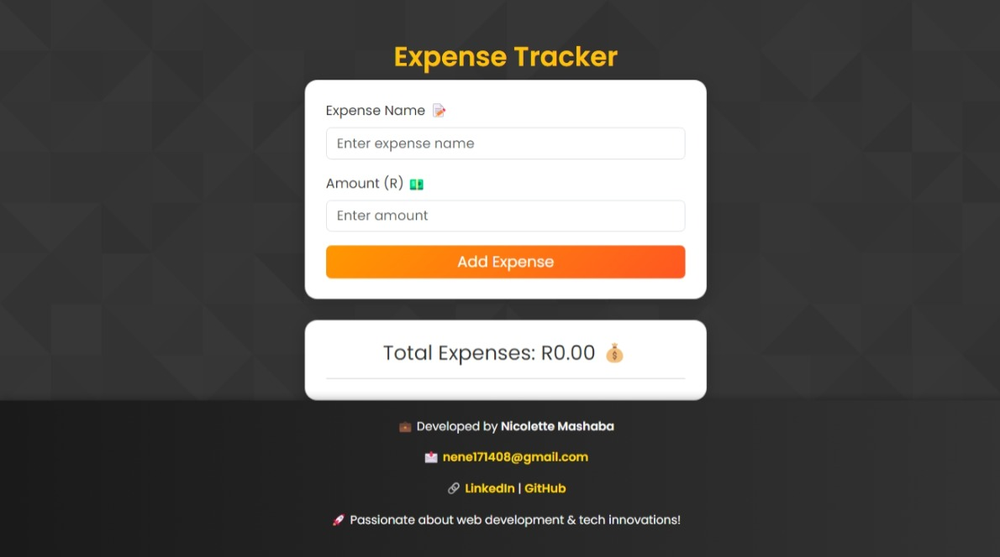

# 💰 Expense Tracker – Smart Financial Management  

A **modern, interactive, and stylish** **Expense Tracker** built with **HTML, CSS, Bootstrap, and JavaScript (ES6)**. Easily track your daily expenses, delete entries, and watch your total update in **real-time**! 🚀  

🔹 **Simple. Sleek. Smart.** 🔹  

  

---

## ✨ **Features**
✅ **Add & Remove Expenses** – Keep your finances in check.  
✅ **Live Total Calculation** – No more manual calculations! 🧮  
✅ **Data Persistence** – Saves your expenses in **localStorage** 🔄  
✅ **Fully Responsive UI** – Built with **Bootstrap 5**, optimized for **mobile & desktop** 📱💻  
✅ **Sleek Modern Design** – Elegant color scheme & icons for a smooth experience 🎨  

---

## 🛠 **Tech Stack**
💻 **Frontend:**  
🔹 HTML5, CSS3  
🔹 Bootstrap 5 (for responsiveness & styling)  
🔹 JavaScript (ES6 for dynamic interactions)  

💾 **Storage:**  
🔹 **localStorage** – Saves data across sessions  

---

## 🚀 **How to Use**
1️⃣ **Clone the repository**  
```sh
 git clone https://github.com/yourusername/expense-tracker.git
```
2️⃣ **Open `index.html` in your browser**  
3️⃣ **Start adding expenses** and watch the magic happen! 🎩✨  
4️⃣ **Click the ❌ icon** to remove an expense  
5️⃣ **Refresh? No problem!** Your data stays saved 🔄  

---

## 🎯 **Future Enhancements**
🔹 **Expense Categories** – Track by food, transport, bills, etc.  
🔹 **Filtering & Sorting** – Easily manage long lists  
🔹 **CSV Export** – Download your expenses for budgeting 📊  

---

## 📜 **License**
🆓 This project is **open-source** and free to use. Contributions are welcome!  

---

### **📩 Connect With Me**
💼 **Developer:** *Nicolette Mashaba*  
📧 Email: [nene171408@gmail.com](nene171408@gmail.com)  
🔗 [LinkedIn](https://www.linkedin.com/in/nicolette-mashaba-b094a5221/) | [GitHub](https://github.com/NickiMash17)  

💡 *"Great financial habits start with tracking where your money goes!"* 🚀  
